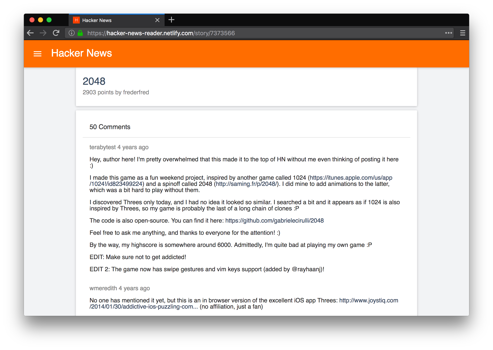

# [Hacker News](https://hnews-client.herokuapp.com/)

> Unofficial [Hacker News](https://news.ycombinator.com/) client.

## Dev

This app was built was built with the following libraries:

- [React](https://facebook.github.io/react/)
- [RxJS](http://reactivex.io/rxjs/)
- [Redux](http://redux.js.org/)
- [Redux-Observable](https://redux-observable.js.org/)

## Commands

- Initialize: `$ npm install`

- Run: `$ npm start`

- Test: `$ npm test`

- Build: `$ npm run build`